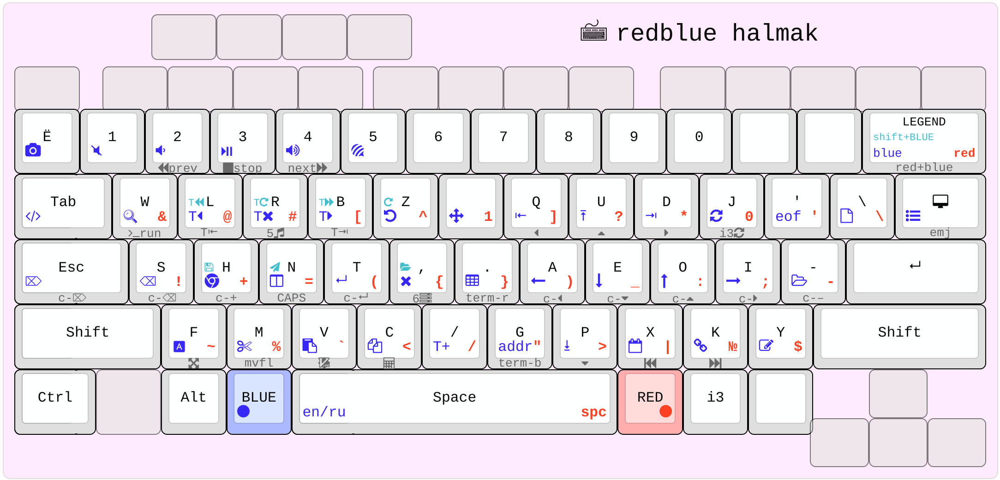
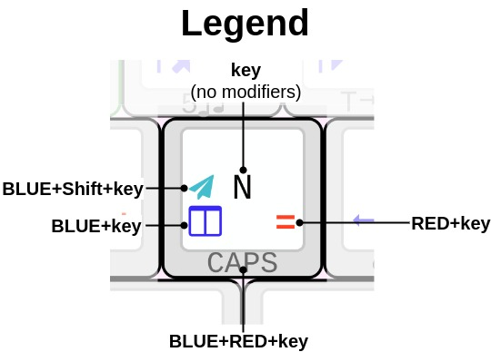
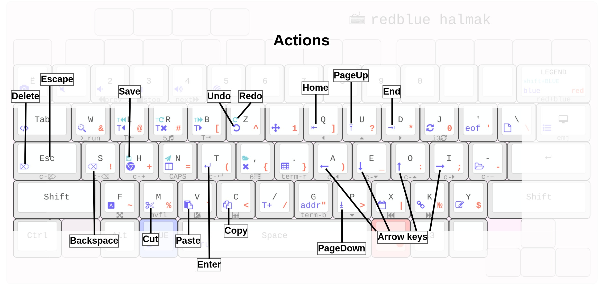
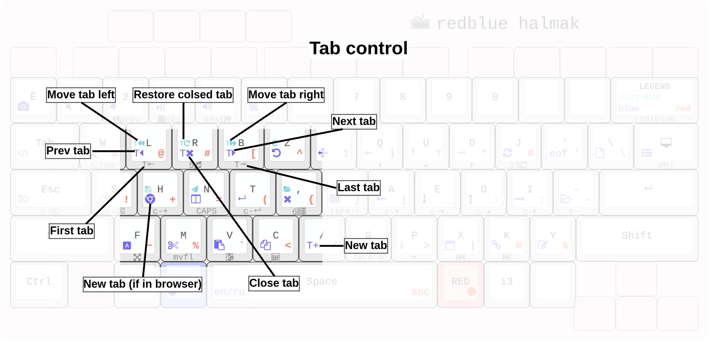
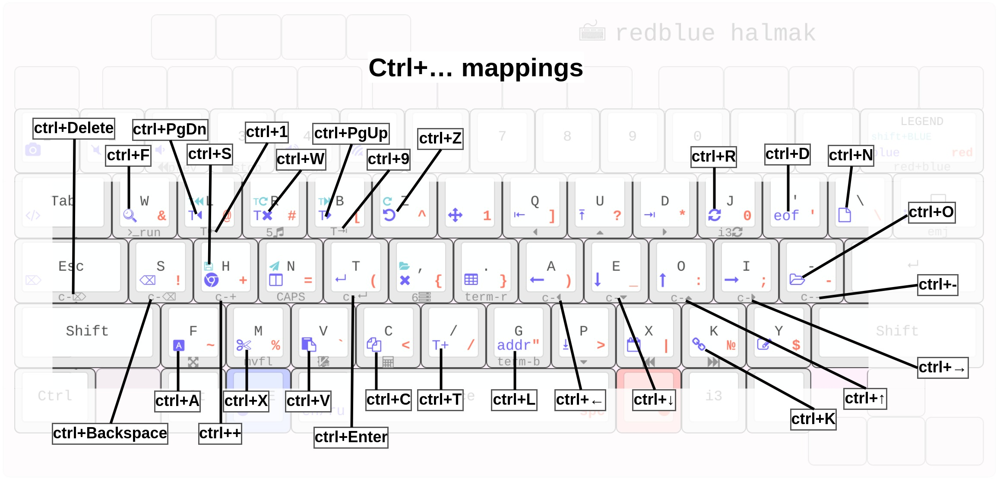
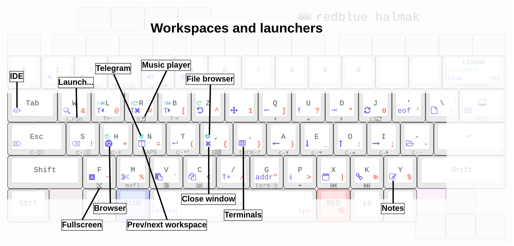
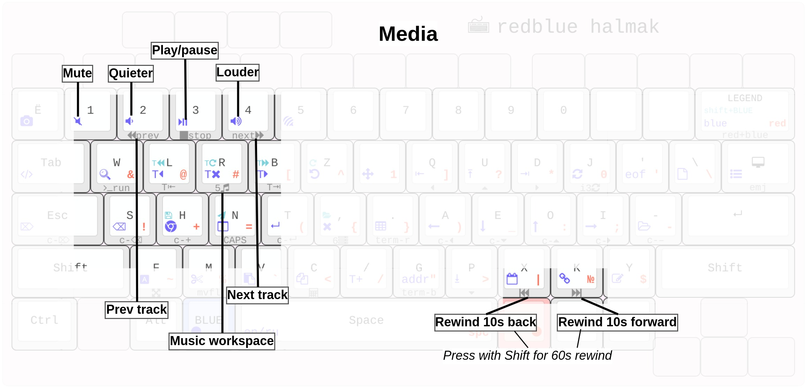
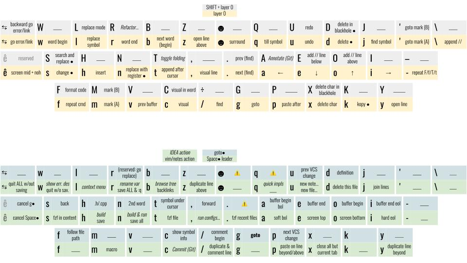
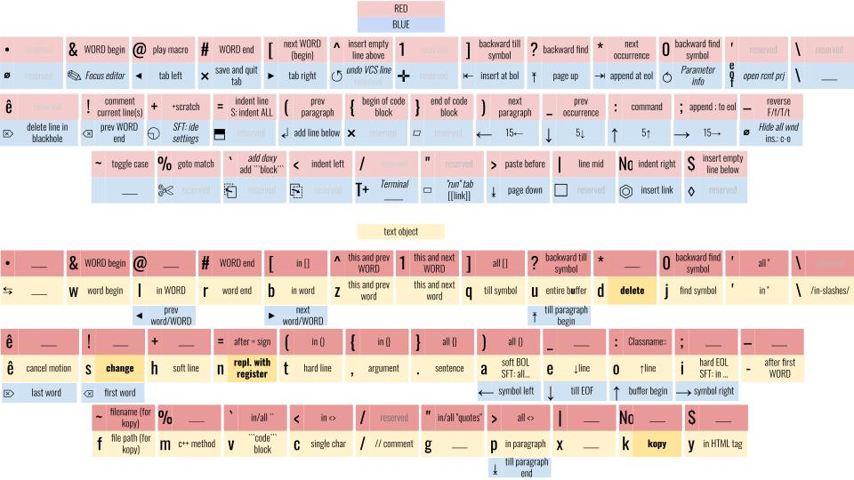
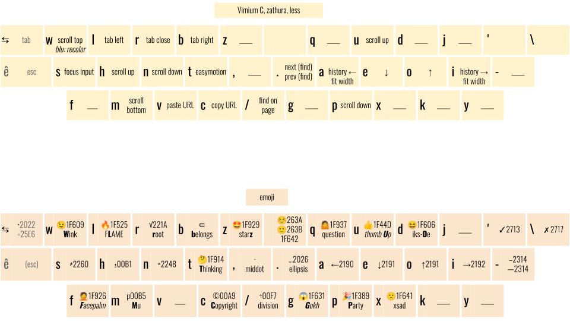

# Redblue semiergonomic Halmak keyboard layout
Semiergonomic because when your keyboard is embedded in a rectangle, the word "ergonomic" can't be used without irony.

**Video overview**: [https://youtu.be/92pRAQeRIak](https://youtu.be/92pRAQeRIak)

## Key points in layout design

- Letters arrangement is [Halmak](https://youtu.be/pZ40gmfDFfQ);
- BLUE and RED add two (actually six) extra layers and are intended to be held with **thumbs**;
- BLUE for navigation/actions, RED for symbols, Shift+RED for emoji (see below), and BLUE+RED usually acts like BLUE+Ctrl
- CapsLock is swapped with Escape ([here is why](https://vim.fandom.com/wiki/Avoid_the_escape_key));
- `Enter` (aka `Return`), `Backspace` and arrows may now be pressed **without any finger movements at all**;
- Enter/Escape/Backspace/Delete are intentionally placed under your **left** hand. Neat for GUI applications (e.g. web browser) that force you to hold a mouse with your right hand;
- Symbols on the RED layer are arranged based on their frequency in C++ and Bash. Mnemonics isn't taken into account, only the convenience/frequency;
- No need for `Ctrl` anymore! See "ctrl remaps" image below;
- Instead of pressing `Alt+Tab` an unpredictable amount of times to switch between windows, you use `BLUE+key` to jump to the target workspace directly (Chrome, Terminal, IDE, Telegram etc.);
- 0 and 1 are the most used number symbols in programming. They're copied to the RED layer to be conveniently typed in expressions like `if (i != 0) {`. Notice that your thumb is holding the `RED` key during the entire ` != 0) {` part, and you never have to reach the number row;
- Most workspace-related keys are multi-functional, e.g. the "Browser" key (`BLUE+H`) will:
    - Open the browser, if it's not yet opened;
    - Go to browser workspace and set focus on it, if it is opened;
    - Open a new tab, if the focus is already on the browser.

## In-depth overview

### Essential actions

### Tabs navigation

### All keys that redirect to Ctrl+something

### Workspaces, windows, launchers

### Media buttons (playerctl)

## VIM configuration
My Halmak .vimrc is  not mnemonic-based anymore. It is instead efficiency-based: most prominent actions are mapped to most accessible keys. No ctrl is used. Shift usage is also minimised.

## Vimium C, zathura, less
Consistent keybindings in all apps

